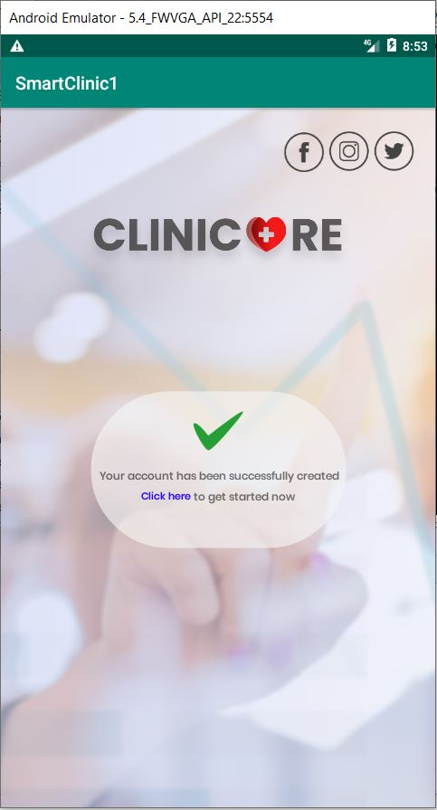

# SmartClinic
In this repository, a few pages of an android application, which was made as part of a clinic web development project, are shown. The app was developed using android studio. This related to my web development project from the link https://github.com/labibsharrarrayat/SmartClinic_front_end. The app is meant to be used by customers who wish to visit the clinic. It should be noted that this is not the complete app, as it only includes the frontend. A few more pages from the app are shown in a separate folder in my repository. Pages:

